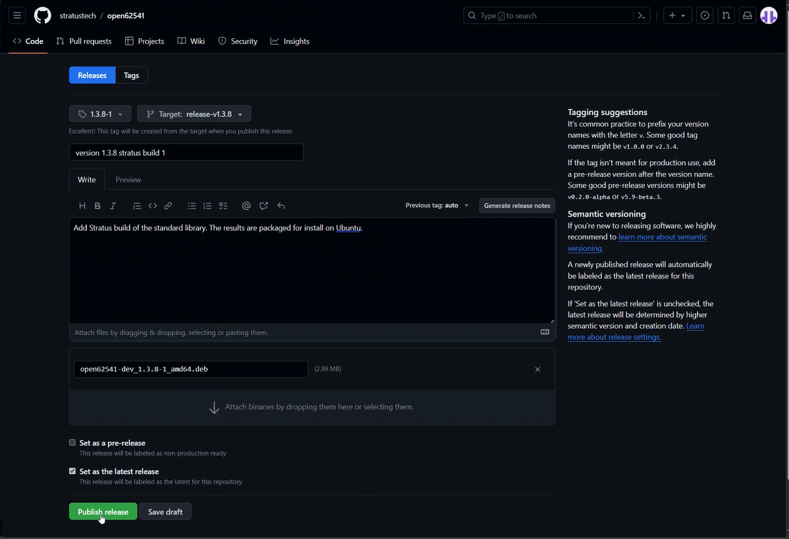
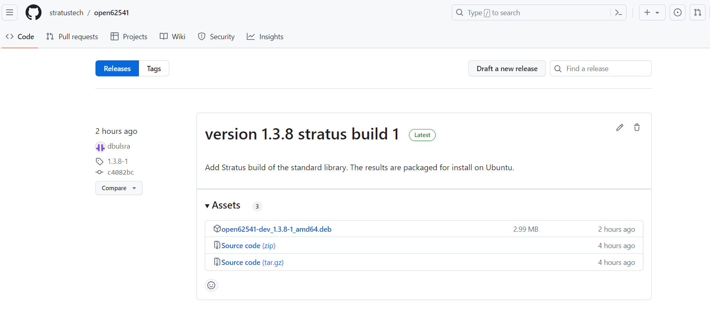

# The Story

We need to build an OPC UA server from open62541 (<http://open62541.org>). To do
this we forked the open62541 repo and added our own build and packaging process.
The resulting package will be installed in our container environment in support
of a product build process.

## Environment

A VSCode dev container environment, suitable for building the package, has been
added to the tree. One can open in Reopen In Container from VSCode. Once
established one need only run ``make``.

## Build

A Makefile has been added to the top of this tree to generate a debian package suitable for install in an Ubuntu environment.

The package version is set in the top of ``Makefile``:

    VERSION ?= 1.3.8-1

This value can be overridden from the environment as such

    env VERSION=1.2.3.4 make

## Versioning

Library version should include the open62541 version, a dash and a version
extension. The extension represents a revision of these additions or any
modifications made to the open62541 sources.

## Releases

Once a version of the library is built, and a package has been created, a release can be published using the github web UI.  Below is a screenshot captured during the creation of the first release.  It is expected that this build will remain static and will only need to be rebuilt if we decide to take a new release from open62541.

Published releases can be found in the Releases page for inclusion in the developement container.

